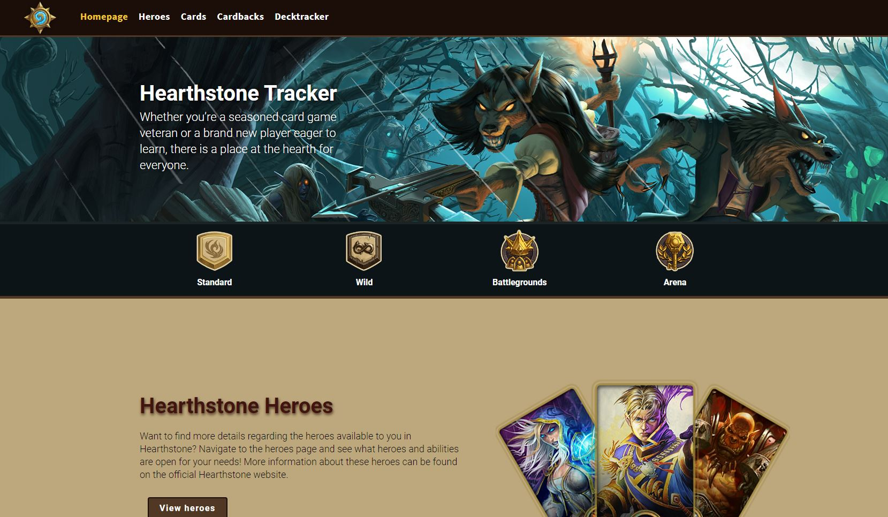

# HearthstoneSingleDayApp

Hearthstone API single day full-stack application for Salt.

## Description

Had to create a full-stack application with a React frontend and a Express backend using an API that made calls from the Express backend and provides it back to the frontend.

### Technical implementations

Frontend

- React with Create-react-app
- React-router-dom, Redux, Redux-thunk
- Lodash, classnames
- Eslint

Backend

- Express
- Node-fetch
- Body-parser (Wow!)

#### Landing page

